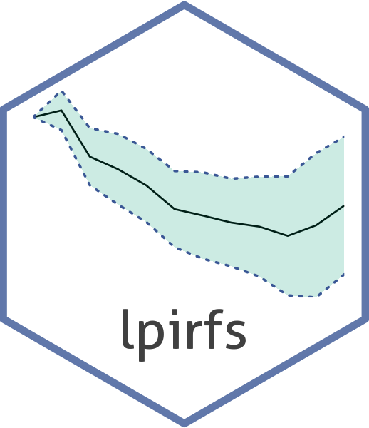

<!-- README.md is generated from README.Rmd. Please edit that file -->

# lpirfs <a href='https://journal.r-project.org/archive/2019/RJ-2019-052/index.html'></a>

<!-- # lpirfs   -->
[](https://CRAN.R-project.org/package=lpirfs)
 [](https://github.com/AdaemmerP/lpirfs/actions)
[](https://CRAN.R-project.org/package=lpirfs)
[](https://CRAN.R-project.org/package=lpirfs)
[](https://app.codecov.io/github/adaemmerp/lpirfs?branch=master)

```{r setup, include = FALSE}
knitr::opts_chunk$set(
  collapse = TRUE,
  comment = "#>",
  fig.path = "man/figures/README-",
  fig.align = "center"
)
```


## About
An R-package which estimates linear and nonlinear impulse responses
with local projections by [Jordà (2005)](https://www.aeaweb.org/articles?id=10.1257/0002828053828518).<br />

## Citation
Please cite the paper by  [Adämmer (2019)](https://journal.r-project.org/archive/2019/RJ-2019-052/index.html)
when using the package.

## Main features

- Estimates linear and nonlinear impulse responses with local projections.
- Estimates linear and nonlinear impulse responses with identified shock and/or with 2SLS.
- Estimates linear and nonlinear impulse responses with local projections for panel data.
- Functions to plot linear and nonlinear impulse responses.
- Functions are partly implemented in *Rcpp*/*RcppArmadillo* and partly written for parallel computation
  to improve efficiency.


## Installation

You can install the released version of **lpirfs** from [CRAN](https://CRAN.R-project.org):

``` r
install.packages("lpirfs")
```

You can install the development version of **lpirfs** from [GitHub](https://github.com/):

``` r
# install.packages("devtools")
devtools::install_github("https://github.com/AdaemmerP/lpirfs/tree/dev")
```

As lpirfs compiles some C++ source code, you will need to have installed the appropriate compilers to build the development version.

## How to use 
The paper about the package can be found [here.](https://journal.r-project.org/archive/2019/RJ-2019-052/index.html)
The vignette of the package can be found [here.](https://cran.r-project.org/package=lpirfs)

## Acknowledgements
I am thankful to Òscar [Jordà](https://sites.google.com/site/oscarjorda/) for encouraging comments and helpful suggestions. I am also indebted to Sarah [Zubairy](https://sites.google.com/site/sarahzubairy/) for providing the Matlab code before the publication of their 
[paper](https://www.journals.uchicago.edu/doi/10.1086/696277). 

I greatly benefitted from the helpful remarks by Jon [Danielsson](https://www.systemicrisk.ac.uk/people/jon-danielsson) and the profound *R*, *Rcpp* and *GitHub* knowledge of Philipp [Wittenberg](https://github.com/wittenberg) and Detlef (overflow) [Steuer](https://github.com/dsteuer).
Last but not least, I am grateful to Philipp Dybowski without whom I would have never started this project.

All remaining errors are obviously mine. 


### Author
Philipp Adämmer

### License

GPL (>= 2)
