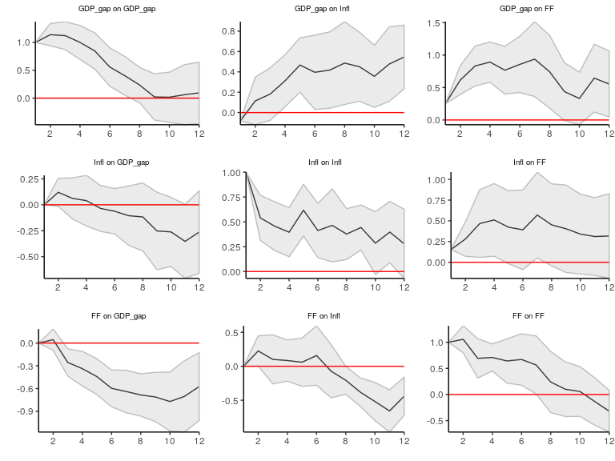
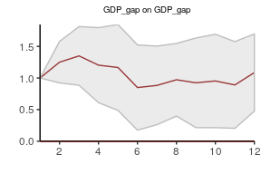

<!-- README.md is generated from README.Rmd. Please edit that file -->
g \# lpirfs An R-package which estimates linear and non-linear impulse responses with local projections by Jordà (2005).

Main features
-------------

-   Estimate linear impulse responses with local projections
-   Estimate non-linear impulse responses with local projections
-   Plot functions to visualize impulse responses
-   To improve efficiency, functions are partly implemented using Rcpp, RcppArmadillo
-   High performance with parallel computation

Installation
------------

You can install the released version of **lpirfs** from [CRAN](https://CRAN.R-project.org):

``` r
install.packages("lpirfs")
```

And the development version from [GitHub](https://github.com/):

``` r
# install.packages("devtools")
devtools::install_github("AdaemmerP/lpirfs")
```

Example
-------

Example: Linear impulse responses
---------------------------------

Load libraries:

``` r
# Load packages
  library(dplyr)
  library(doSNOW)
  library(parallel)
  library(vars)
  library(Rcpp)
  library(lpirfs)
```

Load data set from package to estimate a simple, new-Keynesian, closed- economy model. This data set is used by Jordà (2005) in chapter IV. of his paper. The data description can be found in the data's help file.

``` r
# Load data (from package)
  data_set_df <- interest_rules_var_data
```

Make list and specify input variables to estimate linear irfs.

``` r
# Create list for input
  specs <- list()

# Specify inputs
  specs$lags_lin       <- 4L      # Number of lags
  specs$lags_criterion <- NaN     # Lag length criterion (AICc, AIC or BIC)
  specs$max_lags       <- NaN     # If lags_criterion is chosen, set maximum number of lags  
  specs$trend          <- 0L      # 0 = no trend, 1 = trend, 2 = trend and quadratic trend
  specs$shock_type     <- 1L      # 0 = standard deviation shock, 1 = unit shock
  specs$confint        <- 1.96    # Width of confidence bands: 1 = 68%, 1.67 = 90%, 1.96 = 95%
  specs$hor            <- 12L     # Length of horizon
```

Estimate linear impulse responses

``` r
  results_lin  <- lp_lin(data_set_df, specs)
```

Make all plots with package function

``` r
# Make plots
  linear_plots <- plot_lin_irfs(results_lin)
```

Display single plots:

-   The first plot shows the response of the first variable (GDP\_gap) to the shock of the first variable in 'data\_set\_df'.
-   The second plot shows the response of the second variable (Inflation) to the shock of the first variable (GDP\_gap) in 'data\_set\_df'.

``` r
  linear_plots[[1]]
```


``` r
  linear_plots[[2]]
```


Display all plots:

-   This graph replicates Figure 5 in Jordà (2005), p. 176.
-   Note that the confidence bands are slightly wider (more conservative) than in the original paper.

``` r
# Show all plots
  library(ggpubr)
  library(gridExtra)

  lin_plots_all <- sapply(linear_plots, ggplotGrob)
  marrangeGrob(lin_plots_all, nrow = ncol(data_set_df), ncol = ncol(data_set_df), top=NULL)
```



Example: Non-linear impulse responses
-------------------------------------

Load libraries:

``` r
# Load packages
  library(dplyr)
  library(doSNOW)
  library(parallel)
  library(Rcpp)
  library(lpirfs)
  library(mFilter)
  library(vars)
```

Load data set from package to estimate a non-linear, new-Keynesian, closed- economy model. This data set is used by Jordà (2005) in chapter IV. The data description can be found in the data's help file.

``` r
# Load data (from package)
  data_set_df <- interest_rules_var_data
```

Make list and specify input variables to estimate linear irfs.

``` r
# Create list for input
  specs <- list()

# Specify inputs
  specs$lags_nl        <- 2L      # Number of lags
  specs$lags_criterion <- NaN     # Lag length criterion (AICc, AIC or BIC)
  specs$max_lags       <- NaN     # If lags_criterion is chosen, maximum number of lags  
  specs$trend          <- 2L      # 0 = no trend, 1 = trend, 2 = trend and quadratic trend
  specs$shock_type     <- 1L      # 0 = standard deviation shock, 1 = unit shock
  specs$confint        <- 1.96    # Width of confidence bands: 1 = 68%, 1.67 = 90%, 1.96 = 95%
  specs$hor            <- 12L     # Length of horizon
```

To estimate the non-linear model, provide a switching variable:

``` r
# Specifications for switching variable
  specs$switching      <- data_set_df$FF
  specs$hp_filter      <- 1               # 0 = Do not use HP-filter to decompose switching-variable, 
                                          # 1 = Use HP-filter to decompose switching-variable
  specs$lambda         <- 1600            # Monthly   = 129600,
                                          # Quarterly = 1600,
                                          # Annual    = 6.25
  specs$gamma          <- 3               # Numeric value > 0
```

To differentiate between two regimes, the defined switching variable (z) is plugged into the follwing switching function:

-   $F\_{z\_t} = \\frac{exp(-\\gamma z\_t)}{1 + exp(-\\gamma z\_t)}$

WARNING: To avoid contemporaneous feedback from the switching variable, the index of z is set to *t − 1* (for details see Auerbach and Gorodnichenko; 2012). This is done automatically done in the function *create\_nl\_data*. If you do not want the switching function to be lagged, please provide the switching variable with a lead of one.

-   Regime 1 is defined as: *X*<sub>*t* − *p*</sub> \* (1 − *F*(*z*<sub>*t*</sub>))
-   Regime 2 is defined as: *X*<sub>*t* − *p*</sub> \* (*F*(*z*<sub>*t*</sub>))

Estimate non-linear impulse responses

``` r
  results_nl <- lp_nl(data_set_df, specs)
```

Make all plots with package function

``` r
    nl_plots <- plot_nl_irfs(results_nl)
```

Show first irf of each state:

-   The first plot shows the response of the first variable (GDP\_gap) to the shock of the first variable in 'data\_set\_df'.
-   The second plot shows the response of the second variable (Inflation) to the shock of the first variable (GDP\_gap) in 'data\_set\_df'.

``` r
# Load packages
  library(ggpubr)
  library(gridExtra)

# Save plots based on states
  # State 1: High Inflation rates
  s1_plots <- sapply(nl_plots$gg_s1, ggplotGrob)
  s2_plots <- sapply(nl_plots$gg_s2, ggplotGrob)

  plot(s1_plots[[1]])
```


``` r
  plot(s2_plots[[1]])
```



References
----------

-   Auerbach, A. J., and Gorodnichenko Y. (2012). "Measuring the Output Responses to Fiscal Policy." *American Economic Journal: Economic Policy*, 4 (2): 1-27. [Link](https://www.aeaweb.org/articles?id=10.1257/pol.4.2.1)

-   Jordà, O. (2005) "Estimation and Inference of Impulse Responses by Local Projections." *American Economic Review*, 95 (1): 161-182. [Link](https://www.aeaweb.org/articles?id=10.1257/0002828053828518)

-   Newey W.K., and West K.D. (1987). “A Simple, Positive-Definite, Heteroskedasticity and Autocorrelation Consistent Covariance Matrix.” *Econometrica*, 55, 703–708. [Link](https://www.jstor.org/stable/1913610?seq=1#page_scan_tab_contents)

-   Ramey, V.A., and Zubairy, S. (2018). "Government Spending Multipliers in Good Times and in Bad: Evidence from US Historical Data." Journal of Political Economy, 126 (2), 850-901. [Link](https://www.journals.uchicago.edu/doi/10.1086/696277)

### Author

Philipp Adämmer
