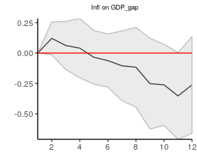

<!-- README.md is generated from README.Rmd. Please edit that file -->
lpirfs
======

An R-package which estimates linear and non-linear impulse responses with local projections by Jordà (2005).

Main features
-------------

-   Linear impulse responses with local projections
-   Non-linear impulse responses with local projections
-   Functions to plot impulse responses

Installation
------------

You can install the released version of **lpirfs** from [CRAN](https://CRAN.R-project.org) or from github:

``` r
install.packages("lpirfs")
# install.packages("devtools")
devtools::install_github("AdaemmerP/lpirfs")
```

Example: Linear impulse responses
---------------------------------

Load libraries:

``` r
# Load packages
  library(dplyr)
  library(doSNOW)
  library(parallel)
  library(Rcpp)
  library(lpirfs)
```

Load data set from package

``` r
# Load data (from package)
  data_set_df <- interest_rules_var_data
```

Make list for input

``` r
# Create list for input
  specs <- list()

# Specify inputs
  specs$lags_lin       <- 4
  specs$lags_criterion <- NaN
  specs$max_lags       <- 2L
  specs$trend          <- 0L
  specs$shock_type     <- 1L
  specs$confint        <- 1.96
  specs$hor            <- 12L
```

Estimate impulse responses

``` r
# Estimate model 
  results_lin  <- lp_lin(data_set_df, specs)
```

Show single plots

``` r
# Make plots
  linear_plots <- plot_lin_irfs(results_lin)


# Show single plots
  linear_plots[[1]]
```


``` r
  linear_plots[[2]]
```



Show all plots. This graph replicates Figure 5 on page 176 in Jordà (2005). Note that these

``` r
# Show all plots
  library(ggpubr)
  library(gridExtra)

  lin_plots_all <- sapply(linear_plots, ggplotGrob)
  marrangeGrob(lin_plots_all, nrow = ncol(data_set_df), ncol = ncol(data_set_df), top=NULL)
```


References
----------

-   Auerbach, A. J., and Gorodnichenko Y. (2012). "Measuring the Output Responses to Fiscal Policy." *American Economic Journal: Economic Policy*, 4 (2): 1-27.

-   Jordà, O. (2005) "Estimation and Inference of Impulse Responses by Local Projections." *American Economic Review*, 95 (1): 161-182.

-   Newey W.K., and West K.D. (1987). “A Simple, Positive-Definite, Heteroskedasticity and Autocorrelation Consistent Covariance Matrix.” *Econometrica*, 55, 703–708.
